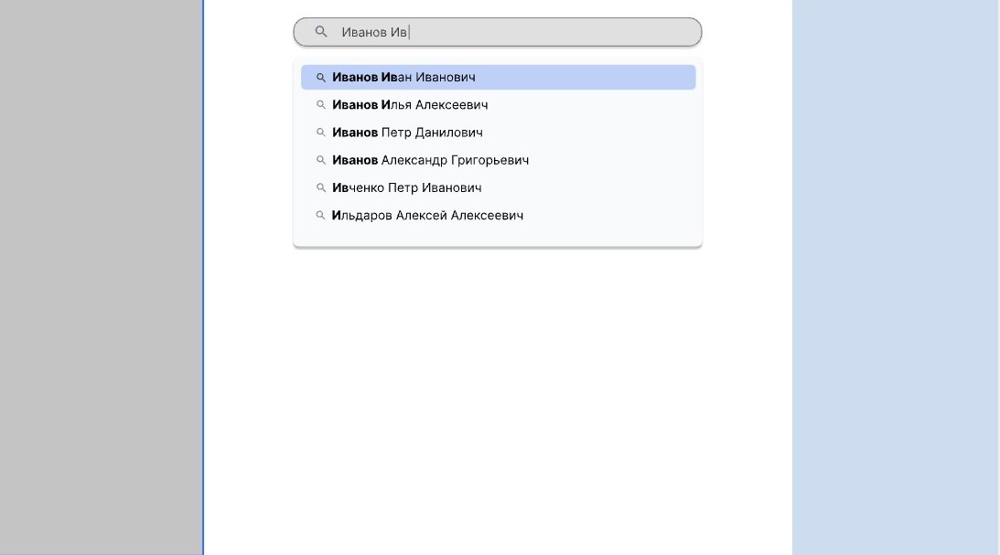
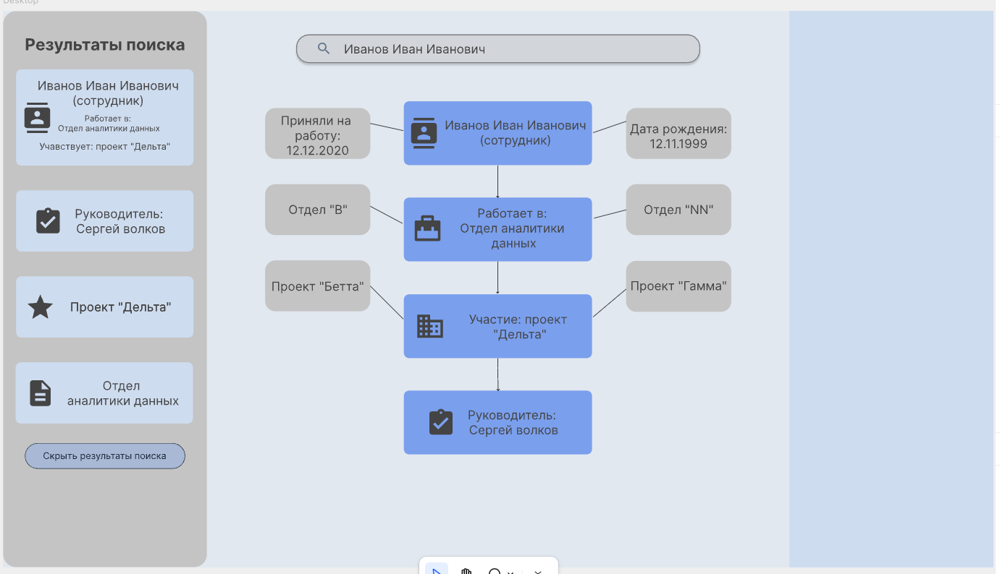
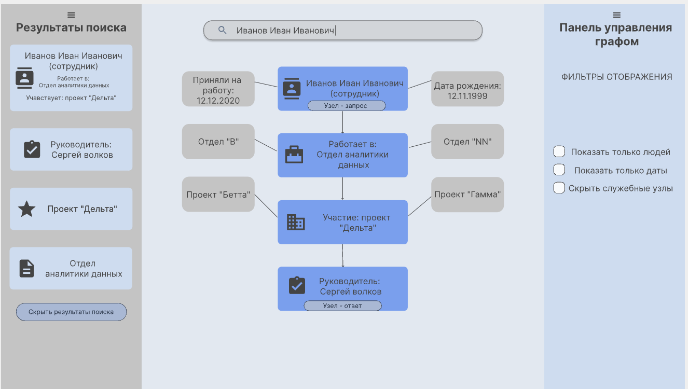

# Popov-System-Module


## 📌 О проекте

В отличие от стандартных баз данных, семантический граф позволяет моделировать нелинейные зависимости между сущностями (людьми, документами, процессами), учитывая контекст их взаимодействия. Модуль предоставляет инструменты для автоматического нахождения маршрутов, контроля логической целостности данных и генерации визуальных отчетов.

---

## ⚙️ Функциональные возможности (Behavior-Driven Development)

Архитектура модуля спроектирована с использованием методологии **BDD (Behavior-Driven Development)**. Все функции описаны на языке Gherkin, что обеспечивает прозрачность логики для разработчиков и конечных пользователей.

### Ключевые сценарии работы:
* **Инициализация (Background):** Гарантирует корректное построение графа в оперативной памяти и установку начальной точки (например, сущности "Студент") перед выполнением любых операций.
* **Поиск кратчайшего пути:** Реализация алгоритмов нахождения оптимального маршрута от начальной вершины до целевого узла (например, «Студент» → «Деканат» → «Приказ об отчислении»).
* **Проверка масштабируемости (Outline):** Тестирование производительности и полноты выборки при разной глубине обхода:
    * **Глубина 1:** Поиск в радиусе 5 ближайших узлов.
    * **Глубина 2:** Расширенный поиск (до 25 узлов).
    * **Глубина 3:** Глобальный анализ связности (100+ узлов).
* **Экспорт визуализации (DocString):** Автоматическая генерация декларативного кода в формате **DOT**. Это позволяет мгновенно визуализировать найденный путь через Graphviz с выделением критических узлов цветом.
* **Табличный анализ смежности (DataTable):** Вывод детальных списков соседей выбранного узла с указанием типа отношения (например: "Обучается в", "Состоит в", "Владеет").
* **Детекция циклов:** Специализированный алгоритм для обнаружения замкнутых логических петель (например, «Студент -> Долг -> Студент»), предотвращающий зацикливание системы при обработке данных.

---

## 🎨 Проектирование интерфейса (UI/UX)

Визуальная часть модуля разработана с соблюдением принципов **Enterprise UI Design**, ориентированных на работу с большими объемами данных. Все макеты созданы в Pixso/Figma с использованием системных компонентов и Auto Layout.

### Основные компоненты интерфейса:
1.  **Интеллектуальная поисковая строка (Search Bar):** * Крупный элемент управления с иконкой поиска.
    * Выпадающий список с предиктивным вводом (автодополнение имен узлов).
      
    
    
3.  **Визуализация пути (Search Path):** * Графическое поле, где найденный маршрут выделен активным цветом (Primary Blue).
    * Использование разной толщины линий для обозначения значимости связей.
    * Приглушение фоновых (неактивных) элементов для концентрации внимания пользователя.
      
    
    
5.  **Панель фильтрации (Filter Panel):** * Боковая панель с чекбоксами для быстрой настройки отображения.
    * Фильтры по категориям: «Люди», «Даты», «Скрыть служебные узлы».
      
    

---

## 🛠 Технологический стек

| Технология | Назначение |
| :--- | :--- |
| **C++** | Высокопроизводительная реализация алгоритмов графовой навигации. |
| **Gherkin / Cucumber** | Написание и выполнение сценариев тестирования поведения системы. |
| **Graphviz (DOT)** | Программная визуализация и генерация графовых схем. |
| **VS Code** | Основная среда разработки и поддержки BDD-сценариев. |
| **Pixso / Figma** | Прототипирование интерфейсов и экспорт графических ассетов. |

---
## 📂 Структура репозитория

```text
Popov-System-Module/
├── 📂 docs/                          # Документация и проектные файлы
│   ├── 📂 gherkin_scenarios/          # Папка с набором из 6 сценариев тестирования
│   │   ├── 📄 scenarios_1.feature     # Нахождение кратчайшего пути
│   │   ├── 📄 scenarios_2.feature     # Проверка масштабируемости (Outline)
│   │   ├── 📄 scenarios_3.feature     # Инициализация графа (Background)
│   │   ├── 📄 scenarios_4.feature     # Генерация кода визуализации (DocString)
│   │   ├── 📄 scenarios_5.feature     # Таблица смежных вершин (DataTable)
│   │   └── 📄 scenarios_6.feature     # Поиск циклических ссылок
│   └── 📂 ui_prototypes/              # Папка со скриншотами интерфейса из Pixso
│       ├── 🖼️ screen_layout_1.png     # Макет поисковой строки
│       ├── 🖼️ screen_layout_2.png     # Визуализация пути поиска
│       └── 🖼️ screen_layout_3.png     # Панель фильтрации
├── 📂 src/                           # Исходный код и спецификации
│   └── 📄 structure.json             # Описание структуры данных модуля
└── 📄 README.md                      # Полное описание проекта
```

## 📚 Список использованных источников

1.  GraphQL Official Draft Specification — https://spec.graphql.org/draft/ (дата обращения 26.03.2026)

2. Cucumber.io: Gherkin Reference Guide — https://cucumber.io/docs/gherkin/ (дата обращения 26.03.2026)

3. MDN Web Docs: CSS Grid Layout — https://developer.mozilla.org/en-US/docs/Web/CSS/CSS_grid_layout (дата обращения 26.03.2026)

4. Docker Documentation: Getting Started — https://docs.docker.com/get-started/ (дата обращения 26.03.2026)

5. React.dev: Built-in React Hooks — https://react.dev/reference/react (дата обращения 26.03.2026)

---

## 🏛 Сведения об авторе
Выполнил: Студент группы 5ИТб-2: А.С. Попов
